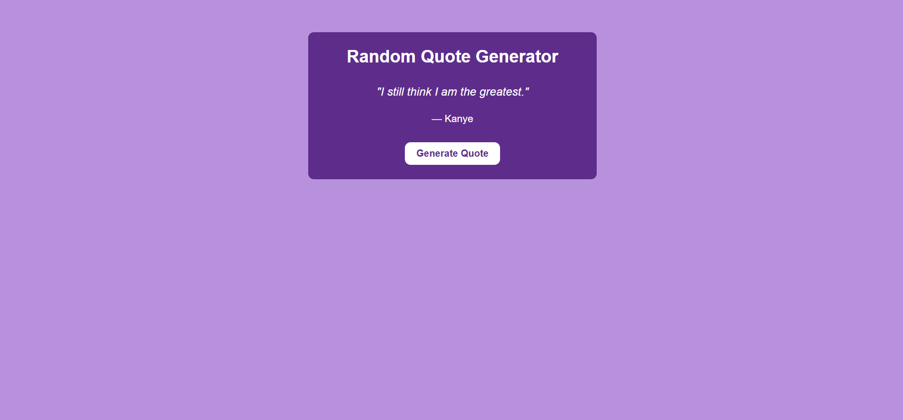

# Random Quote Generator 🧠🎤

This is a mini JavaScript web app that displays random quotes from Kanye West using the [Kanye REST API](https://api.kanye.rest/). It demonstrates the use of `fetch()`, `async/await`, DOM manipulation, and basic error handling.

# 💡 Features
- Click the Generate quote button to get a new Kanye quote
- Clean and minimal UI
- Beginner-friendly JavaScript code

# 🚀 Tech Stack
- HTML
- CSS
- JavaScript (ES6+)
- [Kanye REST API](https://api.kanye.rest/)

# 📸 Preview
 
